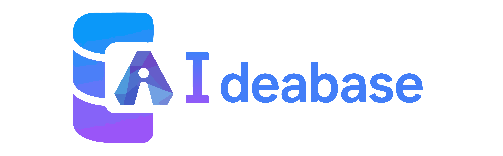

[Ideabase](https://github.com/cocode-chat/ideabase) - AI时代的Firebase, 专注于让每个应用(web,app,miniapp)自然生长出智能对话框。

提供三大核心组件
- AI智能体服务
- BaaS核心基础设施
- 可嵌入的应用对话组件 - Web组件、桌面组件、移动端组件、小程序组件

开发者无需从零搭建后台或混合多种AI服务，就能在其应用中快速集成智能对话体验。业务表现为智能客服、智能询盘、AI员工、...

## 核心概念
### AI时代的BaaS
    BaaS平台：提供数据库、存储、身份验证、云函数等一站式后端服务，节省基础架构搭建和维护成本。
Firebase是Google推出的领先BaaS平台，其产品线包括 Realtime Database、Cloud Firestore、Authentication、Functions等基础服务。

Ideabase在Firebase基础上实现了三大AI能力突破：
1. **业务知识中枢**：将数据库转化为领域知识库，使智能体具备业务专家级认知
2. **业务智能体专家**：基于真实业务数据训练，可：
   - 深度理解业务逻辑和领域知识
   - 自动完成业务场景的复杂决策
   - 提供符合行业规范的专家建议
3. **智能体成长系统**：
   - 持续从业务数据中学习演进
   - 支持多模态业务交互（工单/合同/报表等）
   - 形成可复用的领域知识图谱

这些能力使Ideabase成为首个实现"业务智能体专家化"的BaaS平台。

### 应用对话组件
通过简单引入对应平台组件即可获得完整智能体对话能力：
- **即插即用**：只需几行代码即可集成预制对话组件
- **多平台支持**：提供Web、桌面、移动端、小程序等全平台组件
  - 对话窗口
  - 消息气泡
  - 会话历史
- **智能体集成**：自动连接ideabase的智能体服务，无需额外配置
- **深度定制**：支持主题、皮肤、布局自定义，满足品牌个性化需求

## 功能进度
- [x] Hosted MySQL Database.
  - [x] REST
  - [ ] Cache
  - [ ] Realtime subscriptions
- [ ] AI
  - [x] RAG base on hosted database
  - [ ] RAG base on upload file
  - [ ] MCP autogen
- [ ] File Storage
- [ ] Authentication
- [ ] Authorization
- [ ] Dashboard

## Install
注意替换 [LLM api key](.run/Docker-run-env.properties) 中的EMBEDDING_API_KEY, CONVERSATION_API_KEY
```shell
git clone git@github.com:cocode-chat/ideabase.git
cd ideabase
sh .run/Docker-compose.sh
```

## MySQL DB RESTful API 
See [RESTful](.doc/README-restful.md) docs.

这里特别感谢腾讯开源的[APIJSON](http://apijson.cn/)项目，我们高度认可其协议设计并保持兼容。

与APIJSON采用的深度优先遍历节点不同，Ideabase创新性地实现了广度优先遍历节点合并子查询技术，这一优化显著减少了数据库IO操作。虽然当前实现代码在美观度上还有提升空间，但性能优势已经得到验证。

尤为重要的是，我们成功实现了跨库关联查询功能，这一特性对于资源受限的项目具有极高的实用价值，能够大幅提升开发效率。

## RAG base on hosted database
See [RAG](.doc/README-rag.md) docs.